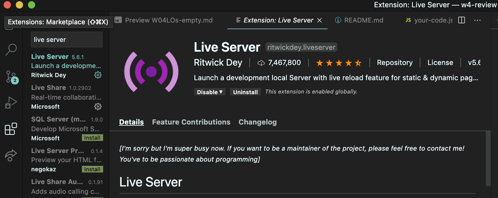

# WEEK 4 STUDY SUGGESTIONS

Here is a suggested outline for studying this weekend:

1. Fill In Learning Objective Document
	 - first: fill out the empty LO document on your own (`W04LOs-empty.md`)
	 - then: compare your document with the filled out version (`W04LOs-explained.md`)

2. Review Weekly Notes
   - additional notes on each days' topics

3. Attempt Practice Assessment 
   - very similar format to the coding portion on the real assessment
	 - a bit more difficult than the real assessment so if you can complete this
	   you should be in great shape
	 * DONT FORGET TO READ THE README
	   - see notes on live server below

4. Review Lecture Demos
	 - I converted some of the lecture demos we reviewed into additional practice problems
	 - these problems can be found in the `lecture-demos` directory
	 - each demo has a `your-code.js` file and a corresponding `solution.js` file
	 - practices labeled "BONUS" are more complex than anything you would see on
	   the assessment, but good practice nevertheless!
	 - suggested order:
	 	 1. create-el-demo
		 2. update-el-demo
		 3. common-events-demo
		 4. bubbling-demo
		 5. form-demo

5. Try Practice Assessment Again

# ASSESSMENT FORMAT
- multiple choice problems, as usual
- coding portion, similar in format to that of the practice test
- length = 1.5 hours

# LIVE SERVER
- VS code extension you must install (see image below)
- launches a development local Server with live reload feature for static & dynamic pages
- to use: right click on the `index.html` file and select "open with live server"

